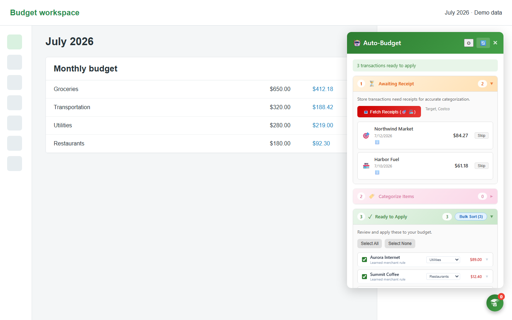
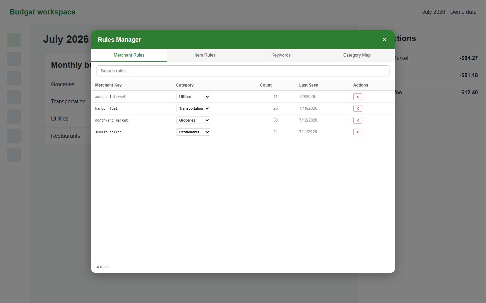

# EveryDollar Transaction Sorter

An unofficial Chrome extension for reviewing, renaming, and categorizing EveryDollar transactions. It learns merchant rules from your own browser data, groups uncertain matches for review, and can pair supported store receipts with transactions.

This project is not affiliated with, endorsed by, or supported by Ramsey Solutions or EveryDollar.

## Features

- Suggests categories with merchant patterns, learned rules, and confidence scores.
- Remembers transaction renames and prior categorization choices.
- Queues uncertain matches for explicit review.
- Supports bulk review and categorization workflows.
- Imports receipt details from supported store order-history pages.
- Proposes split transactions when receipt items span multiple categories.
- Exports a portable local-data snapshot for backup or debugging.

## Screenshots

These captures render the shipped extension interface against synthetic merchants, amounts, and categories. No real financial data is shown.

### Transaction review workflow



### Merchant rule manager



## Privacy and safety

- The extension has no project-operated backend, analytics, or telemetry.
- Learned rules, receipts, and cached transaction data use Chrome local/sync storage.
- Store and budgeting credentials are handled by the sites themselves and are not read from password fields.
- Exported transaction data is sensitive. Keep exports outside this repository and do not commit them.
- Review categorization and split suggestions before applying them.

The extension requests access only to the budgeting and store sites listed in `manifest.json`. Review those permissions before loading the extension.

## Install from source

1. Clone this repository.
2. Open `chrome://extensions/` in Chrome or Edge.
3. Enable **Developer mode**.
4. Select **Load unpacked** and choose the repository folder.
5. Open [EveryDollar](https://www.everydollar.com/app/budget) and use the extension panel.

This project is not published in the Chrome Web Store. Supported websites may change their DOM without notice, which can require selector updates.

## Typical workflow

1. Learn from one or more already-categorized budget months.
2. Scan new transactions.
3. Review high-confidence suggestions and the uncertain queue.
4. Add merchant renames or category rules as needed.
5. Apply approved changes in EveryDollar.

Store receipt import is optional. Sign in to the supported store in the same browser profile, open its order-history page, and start the matching flow from the extension.

## Local data

The extension stores settings and small rules in Chrome sync storage when possible. Larger learned datasets, receipt records, review queues, and transaction caches stay in Chrome local storage.

The **Export Everything** diagnostic creates a JSON snapshot. That snapshot can contain real financial data and is intentionally ignored by Git.

## Development

The project is a dependency-free Manifest V3 extension. After changing a content script, reload the unpacked extension from `chrome://extensions/` and refresh the target site.

```powershell
npm test
```

The validation command checks JavaScript syntax, manifest assets, permissions, and common credential or personal-data mistakes.

## Known limitations

- Categorization is heuristic and can be wrong.
- Receipt matching depends on supported retailers' current page structure.
- The extension cannot guarantee that EveryDollar's internal UI remains compatible.
- Imported receipt details and transaction snapshots are private financial records. Treat them accordingly.

## License

MIT. See [LICENSE](LICENSE).
